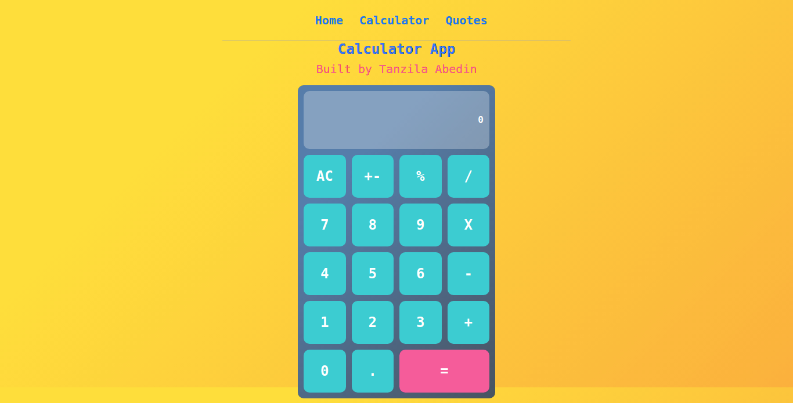

# React Calculator App

Click here to view live [Calculator APP](https://tanzila-calculator.herokuapp.com/ )

# React Calculator

[Click here to view live demo](https://react-calculator-rb.herokuapp.com/)

A calculator web app built using React. Hosted on Heroku. 

Additional description about the project and its features.

## Built With
- JavaScript
- React

## Getting Started
- Download or clone this repo by using `git clone https://github.com/tanzila-abedin/react-calculator.git`
- To run the tests, run `npm run test`.
- To run the local server, run `npm run start`.

👤 **Tanzila**

- GitHub: [@githubhandle](https://github.com/tanzila-abedin)
- Twitter: [@twitterhandle](https://twitter.com/TanzilaAbedin)
## 🤝 Contributing
Contributions, issues, and feature requests are welcome!

Feel free to check the [issues page](../../issues/).

## Show your support
Give a ⭐️ if you like this project!

## Acknowledgments
- Hat tip to anyone whose code was used
- Inspiration
- etc

## 📝 License
This project is [MIT](LICENSE) licensed.
